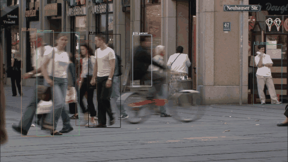
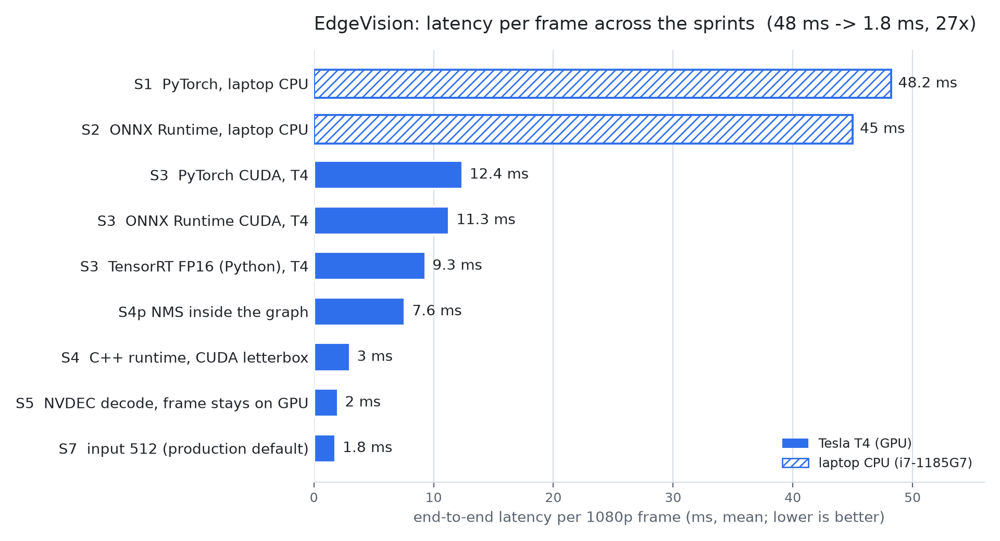

# EdgeVision

[](https://github.com/lucianoon/edgevision/actions/workflows/ci.yml)


**Real-time multi-camera object detection and tracking, taken from a PyTorch notebook-style
baseline to a C++/CUDA runtime, one measured step at a time.** Every stage of the journey has
a benchmark, a test and a written conclusion, so each optimisation is justified by the
bottleneck the previous measurement exposed.



<sub>6 s of the 1080p pedestrian clip (CC0) tracked by the C++ runtime on a Tesla T4; the full-resolution frame is in `docs/tracking_frame.jpg`.</sub>

## Highlights (Tesla T4, 1080p H.264, YOLO26n)

| what | result |
|---|---|
| End-to-end latency per frame (decode on NVDEC, CUDA pre-processing, TensorRT FP16, NMS in graph, tracking) | **2.0 ms + 0.4 ms decode wait** |
| Aggregate throughput, 12 independent streams | **675 frames/s** (compute ceiling of the model on this GPU) |
| Live RTSP cameras at 25 fps with zero dropped frames | **12 tested**, ~27 extrapolated, GPU at 48% |
| Accuracy on COCO val2017 (mAP50-95) | 0.404 @ 640 (matches the published figure), **0.378 @ 512** (production default) |
| Speed-up vs the Python/PyTorch baseline on the same GPU | 12.4 ms -> 2.0 ms per frame (**6x**); vs the CPU baseline 48 ms (**24x**) |
| Tracking cost (ByteTrack, C++, dependency-free) | tens of microseconds per frame |
| Total cloud spend for all GPU measurements | about **US$ 8** (g4dn.xlarge, auto-stopped, zero-cost standby) |

## Architecture

```
 RTSP / file ──► NVDEC (FFmpeg CUDA hwaccel) ──► NV12 frame in GPU memory
                                                      │
                             CUDA kernel: letterbox + BT.601 -> RGB + /255 + NCHW
                                                      │  (writes straight into the engine input)
                             TensorRT 10 engine, FP16 @ 512, NMS inside the graph
                                                      │  1 x 300 x 6  (x1 y1 x2 y2 score class)
                             D2H 7 KB ──► rescale ──► ByteTrack (Kalman + Hungarian, 2 passes)
                                                      │
                                              tracks: id, box, class, score  (JSONL / video)

 N streams: one decoder + one execution context per thread (default), or --batched:
 workers fill slots of a ping-pong N x 3 x S x S buffer and one enqueueV3 serves all.
```

Python (`python/edgevision/`) holds the reference implementation and the benchmark harness;
C++ (`cpp/`) holds the production runtime. Both share the same `Detection` contract and are
checked against each other by parity tests.

## The journey, in measurements

| sprint | step | key number on the T4 | what it taught |
|---|---|---|---|
| 1 | PyTorch/Ultralytics baseline, webcam, FPS counter | 48 ms/frame on a laptop CPU | Warm-up matters: the first figure (155 ms) was noise |
| 2 | Own letterbox + decode + NMS, ONNX Runtime, per-stage metrics | 45 ms (CPU) | Without stage timing you cannot tell where the time goes |
| 3 | TensorRT FP32/FP16 via `trtexec`, Python runtime, GPU box as code | 9.3 ms, 108 fps | FP16 halves GPU time but the frame barely moves: CPU pre/post-processing is 55% |
| 4 prep | NMS inside the graph, real 1080p clip | 7.6 ms, 131 fps | NMS on the GPU is free; pre-processing is now 42% |
| 4 | C++ runtime with a CUDA letterbox kernel, pinned frames | 3.0 ms, 332 fps | Pre-processing 3.5 -> 1.1 ms; CPU video decode is next |
| 5 | NVDEC through libav, RTSP camera simulator | 2.0 ms + 0.4 ms decode, ~415 fps | The frame never touches the CPU; one 25 fps camera uses ~6% of the GPU |
| 6A | N independent streams, live RTSP sweep | 540 fps aggregate ceiling; 12 cameras at 48% GPU | Latency grows 1.6 ms per extra stream; NVDEC is not the limit |
| 6B | Batched inference (static-batch engines, ping-pong buffers) | 552-578 fps (+4-8%) | Batching only tightens tail latency: the model's compute is the ceiling |
| 7 | Accuracy vs speed: input size and INT8, mAP on COCO | 512: +27% throughput for -2.6 mAP; INT8: -3.5 mAP, unbuildable with NMS | Resolution is the cheap lever; INT8 PTQ hurts a nano model |
| 8 | ByteTrack in C++ | tracking ~0 ms; 45 ids / 300 frames | Fewer, longer tracks than Ultralytics' defaults by threshold choice; IoU-only handovers exist |



Full tables, raw JSON reports and observations: [`benchmarks/README.md`](benchmarks/README.md).
Every GPU run wrote its report to `benchmarks/results/`, versioned.

## Repository layout

```
python/edgevision/   detector.py (Ultralytics), onnx_detector.py, tensorrt_detector.py,
                     preprocess.py, postprocess.py (decode + NMS), factory.py, metrics.py,
                     benchmark.py, main.py
cpp/                 CMake project: letterbox.cu, trt_engine.cpp, video_decoder.cpp (NVDEC),
                     detector.cpp, batch_pipeline.cpp, tracker.cpp, main.cpp; CTests
                     (-DEDGEVISION_CPU_ONLY=ON builds the tracker + its test without CUDA)
scripts/             ONNX/engine exports, COCO mAP evaluation, tracking reference,
                     gpu_sprint*.sh (one reproducible measurement per sprint)
scripts/aws/         deploy / resume / standby / run / sync for the GPU box
infra/               CloudFormation for the GPU box, scoped IAM policy, cost notes
docker/              TensorRT container (NGC 26.04 + OpenCV, libav, CMake)
benchmarks/          README with every result, results/*.json reports and logs
tests/               pytest: pre/post-processing, parity between backends, C++ runtime
configs/             app.yaml (backend, engine paths), COCO val/calibration yaml
```

## Reproduce

**CPU only (what the CI runs, ~1 min):**

```bash
uv venv --python 3.12 .venv && uv pip install --python .venv/bin/python -r requirements.lock  # pinned; requirements.txt is the unpinned list
python scripts/export_onnx.py && python scripts/export_onnx.py --nms
pytest -q
PYTHONPATH=python python -m edgevision.benchmark --backend onnx --source <video>
```

**GPU (any machine with an NVIDIA GPU and Docker; the repo used an EC2 g4dn.xlarge):**

```bash
docker build -f docker/Dockerfile.tensorrt -t edgevision:trt .
docker run --rm --gpus all --ipc=host -v $PWD:/workspace/edgevision edgevision:trt scripts/gpu_sprint8.sh
```

`infra/README.md` documents the AWS workflow used here: CloudFormation stack, SSM-only
access, and a zero-cost standby that removes the instance and its disk between sessions.

## Engineering practices worth noting

- **Measure before optimising**: each sprint states a hypothesis, the bottleneck it targets and
  the number it moved. Two hypotheses were rejected by their own measurements (batching, INT8).
- **Tests at every layer**: unit tests for the CUDA kernels (against an OpenCV reference), the
  tracker (synthetic scenes with known identities) and the Python pipeline; parity tests
  between PyTorch, ONNX Runtime, TensorRT and the C++ runtime; CI on every push runs the
  Python suite against pinned dependencies and builds + tests the C++ tracker on the CPU.
- **Infrastructure as code with cost guards**: the GPU box is a CloudFormation template with
  an uptime cap and a standby script; total spend for the whole project was about US$ 8.
- **Findings written down, including the wrong ones**: TensorRT cannot build INT8 for the
  NMS-in-graph export; and a "bug" in Ultralytics' dynamic-batch NMS export turned out to be
  a documented requirement (`batch=<max>`) once the warning was read - corrected in the log.

## Limitations and next steps

- Detects the 80 COCO classes; no faces, plates or behaviour. The natural next layer is rules
  over tracks (zones, counting, dwell time, alerts) and an event output.
- Identity handovers can happen when tracks cross (IoU-only association); appearance
  embeddings (BoT-SORT) would fix that where id purity matters.
- Not yet ported to Jetson: engines are GPU-specific and the aarch64 build needs the device.

## License

MIT. Benchmark clips are CC0 / CC BY (see `videos/README.md`) and are not part of the repository.
